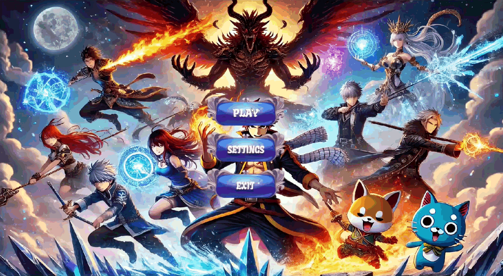

# 🎮 Turn-Based Strategy Game (Pygame)


---

## Overview

A **2D turn-based tactical strategy game** developed in Python using Pygame.  
Players assemble a team of heroes, position strategically on a constrained map, and use abilities intelligently to defeat their opponent.

This project focuses on **game architecture, animation systems, and gameplay mechanics**, rather than just visual design.

---

## Documentation

Full documentation is available here:

👉 https://01alicia.github.io/turn-based-strategy-pygame/

---

## Demo (Coming Soon)




---

## Key Features

- Turn-based gameplay 
- Player-controlled units
- 6 unique heroes with distinct abilities
- Attack & defense system
- Area-of-effect damage mechanics
- Automatic defense resolution
- Grid-based map with terrain constraints
- Custom animation & effect system
- Clean object-oriented architecture (MVC-inspired)

---

## Gameplay

### 🔹 Game Setup

- Players enter their names
- Each player selects **3 heroes** from:
  - Erza
  - Gray
  - Natsu
  - Kansuke
  - Gowther
  - Heisuke

---

### 🔹 Controls

| Action | Key |
|------|-----|
| Attack 1 | `C` |
| Attack 2 | `V` |
| Defense 1 | `A` |
| Defense 2 | `B` |

---

### 🔹 Combat System

- **Single target → 100% damage**
- **AoE nearby targets → 50% damage**

Each unit:

- Has 2 attacks
- Has 2 defensive abilities
- Automatically applies defense when attacked

---

### 🔹 Environment

| Terrain | Effect |
|--------|-------|
| 🌋 Lava | Only **Natsu** survives |
| ❄ Ice | Only **Gray** can move |
| 🌲 Obstacles | Block movement |

---

### 🔹 Victory Condition

> The last player with remaining units wins.

---

## Architecture

The project follows a **modular MVC-inspired architecture**:

```bash
src/
├── model/ # Game logic (units, abilities, combat)
├── view/ # Rendering (animations, map, UI)
├── controller/ # Input handling & game flow
```


### Design Principles

- Separation of concerns
- State-driven logic (idle / attack / defense / dead)
- Factory pattern (hero creation)
- Singleton (global settings)

---

## Technical Highlights

### Animation System

- Spritesheet-based rendering
- Frame extraction & scaling
- Direction-aware animations

### Effect System

- Independent from animations
- Frame-based effects with timing control
- Interpolation (NumPy) for projectile motion

### Game Logic

- Turn management system
- Collision handling (map + units)
- Terrain-based rules
- Range-based targeting system

---

## Tech Stack

- Python 3.10
- Pygame
- NumPy
- MkDocs (documentation)

---

## 🛠 Installation

```bash
git clone https://github.com/01alicia/turn-based-strategy-pygame.git
cd turn-based-strategy-pygame

python -m venv .venv
.venv\Scripts\activate      # Windows
# source .venv/bin/activate # Linux/macOS

### Game
pip install -r requirements.txt

### Documentation
pip install -r requirements-docs.txt
```

## Running the Game

```bash
python main.py
```

## Project Background

This project was developed as part of an Object-Oriented Programming course.

### Objectives:

* Apply OOP principles (inheritance, abstraction, composition)
* Design a modular system
* Build a complete interactive application using Pygame

## Future Work

* AI opponent
* Online multiplayer
* Replace assets with original artwork
* Configurable game parameters
* Unit testing

## Contributors
Developed as part of an academic project.

- Zakaria Allouche
- Amine Nait Si Ahmed

This repository is a cleaned, refactored, and documented version of the original academic project.

## ⚠ Assets & Attribution

This project uses third-party visual assets for educational purposes only.

**Sources include:**

* itch.io
* Freepik
* The Spriters Resource

Some assets were modified to fit the project.

Due to incomplete attribution records, individual authors may not be explicitly listed.
All rights remain with their respective creators.

This project is non-commercial.