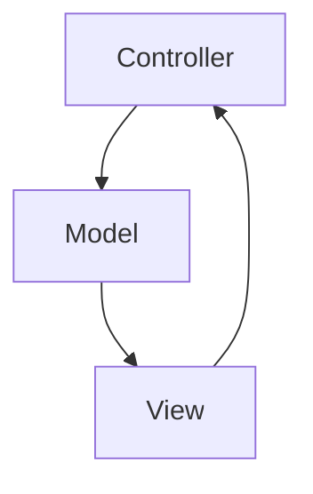

# DOC

This section provides a detailed reference of the project's internal Python modules.

## Architecture Overview

## Layers
### Controller Layer

`src.controller` handles user input, menu navigation, and gameplay action coordination.

### Model Layer

`src.model` defines gameplay entities, units, players, attacks, defenses, and hero creation.

### View Layer

`src.view` handles rendering, sprites, animations, effects, menus, maps, and screen display.

## How to Use This Documentation

Use the navigation menu to explore each package, module, class, and method.

Each module page contains class definitions, method documentation, parameters, return values, and side effects.